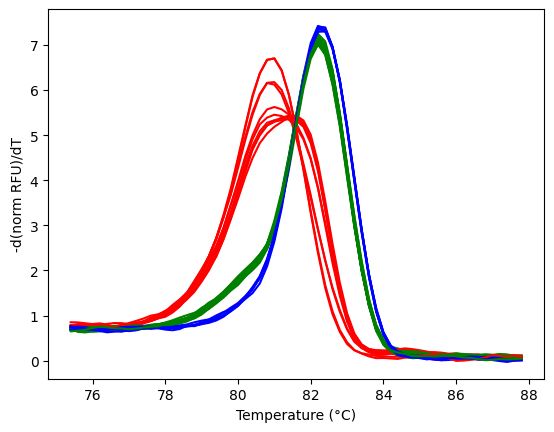

# hrmPy
A simple python package to handle High Resolution Melting (HRM) experiment data analysis. For full functionality see [tutorial.ipynb](https://github.com/satriobio/hrmpy/blob/dev/tutorial.ipynb).  

## Quick start
Install dependencies
```
pip install -r requirements.txt
pip install hrmpy
```

Create simple visulization with clustering
```
from hrmpy import HRM
import pandas as pd
import matplotlib.pyplot as plt

df = pd.read_csv('./Sample-HRM-p50-genotyping.csv')

hrm = HRM(df)
hrm.subset((75,88))
hrm.clustering('kmeans', 3)
data = hrm.diff()

palette = ['red', 'blue', 'green']

for i in range(len(data.columns)):
    column = data.columns[i]
    plt.plot(hrm.temp, data[column], color=palette[hrm.cluster[i]])

plt.xlabel('Temperature (°C)')
plt.ylabel('-d(norm RFU)/dT') 
```


Find sample Tm
```
hrm.tm()
```
```
   Sample  Temperature
0      G6         81.0
1      G7         82.2
2      G8         82.2
3      G9         82.2
4     G10         82.2
...
31    J10         82.2
32    J11         82.4
33    J12         81.0
34    J13         82.2
35    J14         82.2
```

## Data input
Technically melting data from any instrument should work, as long it is formatted correctlly.

- Remove empty columns or empty rows
- First column should be 'Temperature' and the rest is  melting data with sample or 'well' as column name.

Please see [Sample-HRM-p50-genotyping.csv](https://github.com/satriobio/hrmpy/blob/dev/Sample-HRM-p50-genotyping.csv) for input example.

## Credit
- hrmpy is implementation and improvement of liuyigh's [PyHRM](https://github.com/liuyigh/PyHRM/tree/master)
- example input Sample-HRM-p50-genotyping.csv is created by liuyigh 